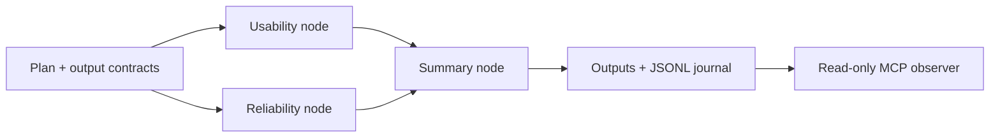

# Flaight

**Staged workflows for agent work, with explicit dependencies, output contracts and a run journal.**

Split a job into nodes, run independent work in parallel, and pass its artifacts to the next stage. Inspect what ran, which checks passed, and where human approval is needed.

This standalone source release includes the workflow engine, an offline CLI and a read-only MCP observer. It is extracted from a larger system; the hosted interface, Tower task registry and company workspaces are separate.

## Try it without an API key

Requires Node.js 22 or 24 and pnpm 11.

```sh
pnpm install --frozen-lockfile
pnpm typecheck
pnpm test
pnpm flaight validate examples/research-review.json
pnpm flaight simulate examples/research-review.json
```

The example runs two analysis nodes followed by a summary node. A new `runs/sim-*` directory contains `plan.json`, `run.jsonl`, and the declared outputs.

**Simulation uses canned responses.** It exercises scheduling, dependencies, persistence and contracts; it does not demonstrate research quality or live model execution. The supplied simulator rejects CLI executors, injected files, tools and separately routed judges.



## What is included

| Area | Surface |
| --- | --- |
| Plans | Stages, nodes, dependencies, artifact paths and schema validation |
| Execution | Bounded concurrency, journals, checkpoints and injected generator interface |
| Review | Output validation, judge hooks, repair and human approval machinery |
| Local CLI | Plan validation and isolated offline simulation |
| MCP | `list_runs` and `read_run_artifact` over stdio |

The engine's `runPlan(plan, runId, deps)` accepts a generator through `RunDeps.generate`. See [the simulator adapter](lib/public/simulate.ts) for a complete local integration and [the runner types](lib/opused/fleet/run.ts) for the lower-level API. Provider and CLI executor code is included as integration code; this release does not certify those external services or configure their credentials. Running the lower-level engine with tools or CLI executors can execute processes and incur provider costs.

## Connect an MCP client

After installation, configure a local stdio server using absolute paths for your clone and runs directory:

```json
{
  "mcpServers": {
    "flaight": {
      "command": "node",
      "args": ["--import", "tsx", "scripts/mcp.ts", "/absolute/path/to/flaight/runs"],
      "cwd": "/absolute/path/to/flaight"
    }
  }
}
```

The observer reads only the stored plan, journal and outputs declared in that plan, up to 64 KiB per artifact. It refuses traversal, external symlinks and undeclared files. This is a local operator tool for a trusted directory, not a hosted multi-tenant authorization boundary. Run presence alone is not proof of completion.

## Verification and boundaries

The test suite covers planning, contracts, gates, output validation and local protocol behavior. Integration tests run the actual scheduler and MCP client/server exchange, including deliberately invalid output, traversal and external-executor rejection. No paid model calls are part of release verification.

The private Tower completion writeback and original site integrations are excluded. Company plans, run history, secrets and customer material are not bundled. Existing `opused` names identify the engine's earlier internal module layout.

Apache-2.0. See [LICENSE](LICENSE) and [NOTICE](NOTICE).
